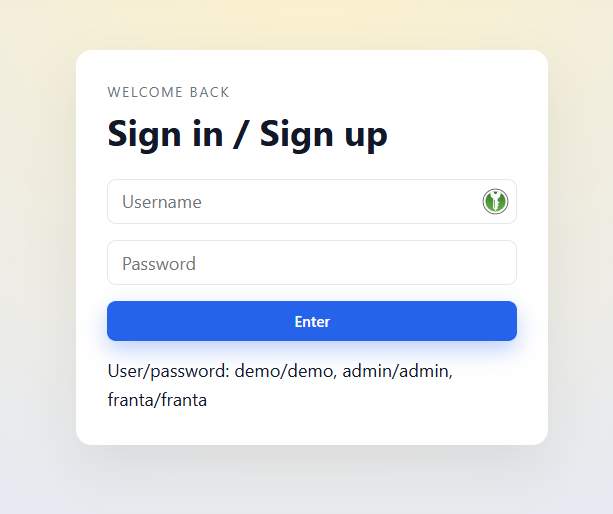
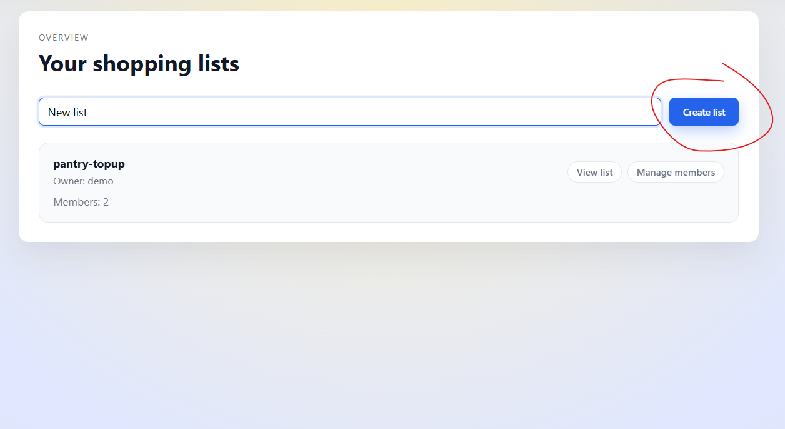
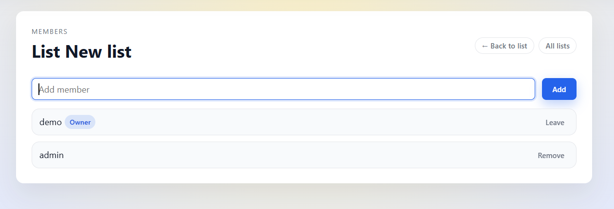
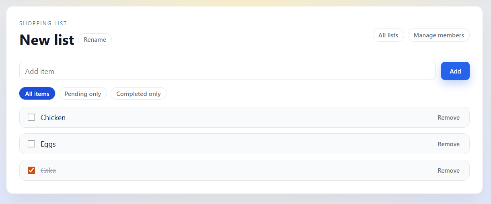
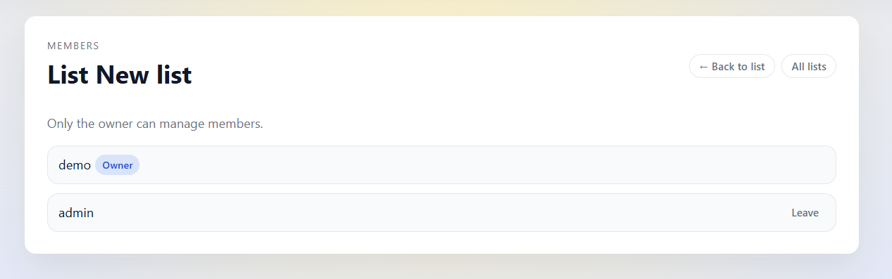
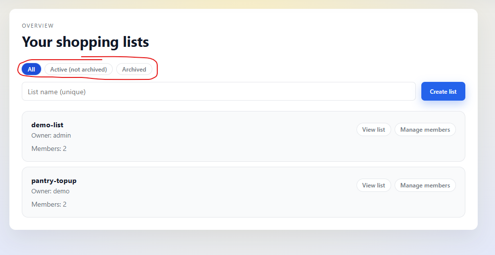
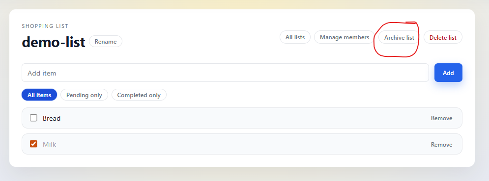

# Shopping List Frontend

Use the steps below to get the frontend and its MongoDB-backed API running.

## Start the backend

1. Switch to the backend folder:

   ```bash
   cd backendMock
   ```

2. Start MongoDB via Docker (runs mongo:8.2.2 locally):

   ```bash
   docker compose up -d
   ```

3. Copy the sample environment and adjust if needed:

   ```bash
   cp .env.example .env
   ```

   `MONGODB_URI` defaults to `mongodb://localhost:27017/shopping-list`.

4. Install dependencies (first run only):

   ```bash
   npm install
   ```

5. Start the API server (defaults to http://localhost:8081):

   ```bash
   npm start &
   ```

6. Back to root folder
   ```bash
   cd ..
   ```

Backend layout follows a simple Express best-practice split: `src/app.js` wires middleware and routes, `src/routes` + `src/controllers` hold endpoints, `src/models` contains Mongoose schemas, and `src/config/db.js` manages the MongoDB connection.

## Start the FE dev server

1. Install dependencies:

   ```bash
   npm install
   ```

2. Launch Vite in development mode (in the project root):

   ```bash
   npm run dev
   ```

3. Open the URL printed in the terminal (defaults to http://localhost:8080) to start testing.

## Testing the app

### 1. Login

- Username: demo
- password: demo

  

### 2. Create shopping list

  
### 3. Add member admin
  

### 4. Go back to list and add items
 - you can rename your newly created shopping list here
  
  
### 5. Logout from demo user and login as admin
 - you can add, check or remove items from created list your created list as a demo user
 - you can filter items by "Pending only" or "Completed only"
 - you can leave the shopping list in manage members
  
  

### 6. Archive and filter by archive
 - you can filter shopping lists by archive

  

  


### 7. Deleting shopping list
 - you can delete shopping lists you own
  
  
